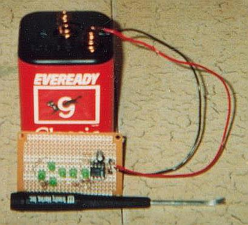
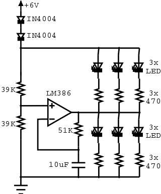

LED-386
=======

A 386-based LED blinker
-----------------------

The LM386 audio amplifier IC, that is...

[Download the .dia file of the schematic](https://github.com/catseye/Electronics-Projects/blob/master/led386/doc/led386.dia?raw=true).
