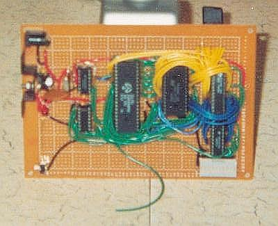
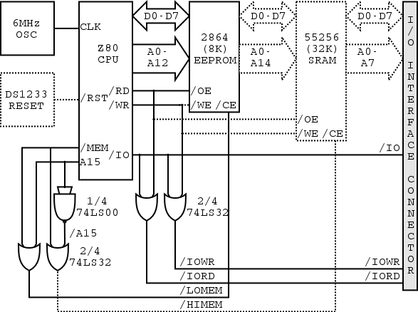

Mildred
=======

*January 10 2003*

Mildred is a homebrew computer. Since it is continually changing, this
document describes both the current state of Mildred, and what it would
be nice for it to eventually be.

Overview
--------

The core of Mildred resides on a single board, and consists of a power
supply, clock, central processing unit (CPU), reset circuitry, address
decoding circuitry, memory, built-in I/O devices, and an external
interface connector.

### Board

The board is from Radio Shack and is a copper-pad-per-hole protoyping
board. Components are soldered to the board, with point-to-point wiring
and some fairly ugly solder bridges used to connect them. Sockets are
used for all ICs so that they can be extracted and replaced when needed.

### Power Supply

The power supply consists of a 7805, which regulates the incoming
voltage (from a 6V-9V wall AC adapter) to 5V. The excess power is
disapated as heat. A diode serves two purposes: to protect Mildred if a
wall adapter with the wrong polarity is used (the wall adapter in this
case has switchable polarity, so it's always possible to make a
mistake); and to deliver 8.4V from a 9V wall adapter to lessen the heat
on the 7805 (since it only needs 8V in to regulate 5V out - anything
above that is just wasted.) There are also a couple of capacitors around
the 7805 intended to smooth out any power spikes to the board, and a red
LED indicating power-on.

### Clock

The clock is a 6MHZ crystal oscillator circuit fashioned out of a 6MHZ
crystal, some small capacitors and resistors, and 3/4 of a 74LS00 chip.
References: based largely on design \#3 on [this
page](http://www.z80.info/uexosc.htm) and design \#13 on [this
page](http://www.geocities.com/dsaproject/electronics/cook-book/cook_book_11_20.html).
The clock drives the CPU, which in turn drives everything else. The
clock should probably be jumpered to make debugging easier.

### CPU

The CPU is a Z84000. This processor is essentially a Z80, and is being
treated as such in Mildred. It has an 8-bit data bus and a 16-bit
address bus. To keep things simple, interrupts, bus requests, and
dynamic RAM refresh are not used.

### Reset Mechanism

Currently, Mildred must be manually reset after power-on by the reset
switch (which simply grounds the /RST line of the Z80.) Ideally, a
DS1223 reset circuit would be used as to consume neglible real estate on
the board.

### Address Decoding

The address decoding circuit is very simple - it uses a single 74LS32 to
determine the chip select signals `/LOMEM, /HIMEM, /IORD`, and `/IOWR`
based on the `/RD, /WR, /MREQ, /IOREQ, A15`, and `/A15` lines from the
CPU. (Actually, `/A15` is generated by the remaining 1/4 of the 74LS00
used for the clock.)

### Memory

Mildred's read-only memory consists of a single 2864 EEPROM which can
store up to 64 kilobits (8 kilobytes) of data. Like all chips on the
board, it is socketed so that it can be extracted and reprogrammed.
(Note: Mildred should have been given a good quality socket here, it
would have saved many moments of frustration.) Since it is selected by
/LOMEM, the 2864 resides at memory locations 0000-1FFF and is mirrored
at 2000-3FFF, 4000-5FFF, and 6000-7FFF. It could also eventually be
replaced by a 27256 32K EPROM for larger programs (and would then occupy
0000-7FFF).

Given that EEPROM is very slow to write to, and that it has a limit to
the total number of possible writes that can be made to it, it is not
write-enabled in Mildred and therefore acts as ROM. This may however
change in the future, to allow Mildred to become an EEPROM programmer.
The risk is that an accidental loop (or a messy power-down condition w/o
the DS1223) could munge boot code. Therefore, /WR should probably be
jumpered at the 2864.

Mildred's RAM consists of a single 55256 (although its socket is not
fully wired yet.) This chip is 32 kilobytes of fast (15 ns!) static RAM.
It allows programs to incorporate a heap, or a stack, etc, and should
make it possible to run more sophisticated programs. It also puts the
address decoding circuit to better use. It is selected by /HIMEM and
thus occupies memory locations 8000-FFFF.

### I/O Interface

The external interface connector is a 40-pin IDC header which is not yet
connected. /MEMRQ, /IORQ, /RD, /WR, /IORD, /IOWR, the 8-line data bus
and at least the lowest 8 lines of the address bus (eventually, probably
all 16) will be brought down to it, so that an I/O board and/or
diagnostic equipment, may be attached to Mildred.

I/O device decoding would reside on the I/O board and would probably
consist of two 74LS138's, enabled by /IORD and /IOWR, and driven by A5,
A6, and A7, selecting one of eight input and eight output devices.

Block Diagram
-------------

Testing
-------

-   Construct power supply and test output voltage. Result: multimeter
    reads 5.00V +/- 0.01V between output of 7805 and ground.
-   Construct clock and test frequency. Result: multimeter reads 6.00
    MHz +/- 0.01MHz between clock and ground.
-   Construct CPU and EEPROM sockets and decoding logic, wire busses,
    plug in CPU and test. Result: CPU operation seems normal. At one
    point supply voltage to CPU measures 5.5V for unknown reason, but
    problem seems to fix itself momentarily (Hail Eris).
-   Program EEPROM with test program (in this case, using dipswitches
    and LEDs on a breadboard):

        0000: OUT (0), A
        0002: JP 0000

-   Run program and watch /IOWR line. Result: programming seems fine
    (address lines conform to what would be expected for
    instruction fetches) but /IOWR fails to strobe. Diagnosis: After
    several re-programming attempts and diagnosis (using LEDs and a slow
    clock as a makeshift logic probe) problem is discovered: two inputs
    to the 75LS32 chip were mistakenly swapped. Solution: desolder and
    resolder swapped lines. /IOWR strobes fine at 120 Hz.
-   Attempt to run test program at higher clock speed. Result: again,
    address lines strobe OK but /IOWR and /IORQ don't even budge.
    Diagnosis: makeshift slow clock (4093-based) is not producing a 50%
    duty cycle. Solution: Replace with 4011-based oscillator. /IOWR now
    strobes fine up to \~5 MHz.
-   Attempt to run at higest clock speed (from internal 6MHz
    crystal oscillator.) Result: once again, address lines are OK but
    not a peep from /IOWR or /IORQ. Diagnosis: Crystal oscillator is not
    driving hard enough. Solution: add 470 ohm pullup resistor from
    output to oscillator to +5V. /IOWR now strobes fine at 286 KHz.
-   Construct RAM.

